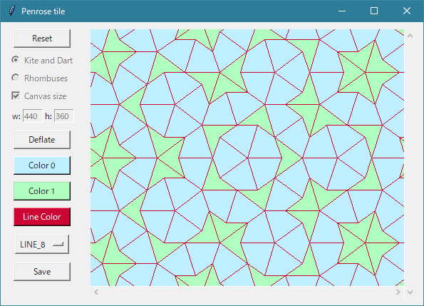

# penrose tile

ペンローズタイルを描画するプログラムです。

動作確認は以下の環境で行いました。

- Python 3.12.2
- Windows 10 Home 2004

以下のパッケージを使用します。

- numpy==1.26.4
- opencv-python==4.9.0.80
- Pillow==10.2.0

GUI は Tkinter です。

参考にしたサイト

- [Penrose tiling - Rosetta Code](https://rosettacode.org/wiki/Penrose_tiling)
- [Penrose Tiling Explained](https://preshing.com/20110831/penrose-tiling-explained/)
- [How to construct Penrose tilings](https://tartarus.org/~simon/20110412-penrose/penrose.xhtml)
- [Python, OpenCVで図形描画（線、長方形、円、矢印、文字など） | note.nkmk.me](https://note.nkmk.me/python-opencv-draw-function/)
- [Tkinterで作成したウインドウにOpenCV-Pythonの画像を表示 - Qiita](https://qiita.com/mizoe@github/items/bc56441e80b3ccd5b2a4)
- [Tkinter 入門: 2. Widget を配置しよう](https://www.shido.info/py/tkinter2.html)
- [tkinterでスクロールを表示するサンプル - Qiita](https://qiita.com/hatorijobs/items/afa037278ef442cddbc5)
